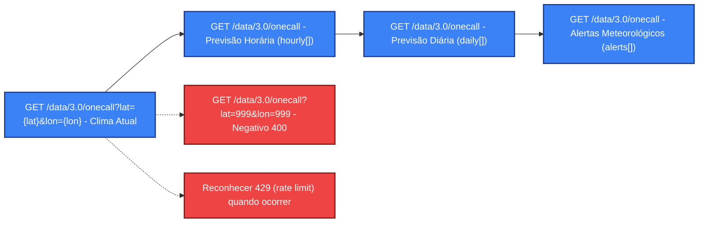

# <h1 align="center">Portfólio QA – Testes de API com Postman (OpenWeather v3.0) 👨🏻‍💻

Este projeto integra meu portfólio de **Quality Assurance (QA)** e demonstra o uso do **Postman** para testes de API na **OpenWeather v3.0** (endpoint *One Call*).  
A suíte valida **clima atual**, **previsão horária**, **previsão diária** e **alertas meteorológicos**, além de **casos negativos** (coordenadas inválidas).

## 📌 O que foi feito
- Validação de status code, formato JSON e **SLA** simples
- Checagens de **estrutura e tipos** nos blocos `current`, `hourly`, `daily` e `alerts`
- Verificação de **coerência** entre `lat/lon` do ambiente e do payload (tolerância)
- **Casos negativos**: 400 (coordenadas inválidas) e reconhecimento de 429 (rate limit)
- Organização em pastas temáticas: *Clima Atual*, *Previsão Horária*, *Previsão Diária*, *Alertas Meteorológicos* e *Negativos*

## 🚀 Como usar no Postman
1. Baixe os arquivos em `postman/` deste repositório:
   - Environment: `OpenWeather v3.0 (Publico).postman_environment.json`
   - Collection: `QA Portfolio – OpenWeather v3.0.postman_collection.json`
2. Importe a **Collection** e o **Environment** no Postman.
3. No **Environment**, configure:
   - `apiKey` → sua API key da OpenWeather
   - `base_url` → `https://api.openweathermap.org`
   - `lat`, `lon` → por padrão `-23.55`, `-46.63` (São Paulo) — pode ajustar
   - `units` → `metric` (opções: `metric`, `imperial`, `standard`)
   - `lang` → `pt_br`
   - (opcional para negativo) `invalidLat=999`, `invalidLon=999`
4. Execute as requisições nas pastas:
   - **Clima Atual** (One Call – visão consolidada)
   - **Previsão Horária** (`hourly[]`)
   - **Previsão Diária** (`daily[]`)
   - **Alertas Meteorológicos** (`alerts[]` – pode não existir para a região)
   - **Negativos** (coordenadas inválidas)

## <h1 align="center">🔄 Fluxo dos testes (One Call)

## ✅ Exemplos de validações (resumo)
- **Clima Atual**: `lat/lon` ~ ambiente (tolerância); `current.temp` é numérico; `current.weather[0].description` existe.
- **Previsão Horária**: `hourly[0]` contém chaves `dt`, `temp`, `feels_like`, `pressure`, `humidity`, `wind_speed`, `pop` e `weather[0].description`.
- **Previsão Diária**: `daily[0]` possui `dt`, `temp.min`, `temp.max`, `humidity`, `pressure`, `clouds` e `weather[0].description`.
- **Alertas**: quando `alerts` existe, valida `event`, `description`, `start`, `end`. Se não existir, apenas loga.

## 🧪 Observações técnicas
- A variável da chave de API no **Environment** é `apiKey`.
- Os testes tratam `alerts` como **opcional** (pode não haver fenômenos ativos).
- Para `lat/lon`, utiliza-se **tolerância numérica** para evitar falsos negativos.
- Estrutura pensada para evoluir com **Geocoding** e **Air Pollution** (futuro).

## <h1 align="center">📊 Estatísticas

### 👤 Perfil GitHub

---

### 📂 Este Repositório

---

### <h1 align="center">📈 Gráfico de Contribuições

<h1 align="center">

